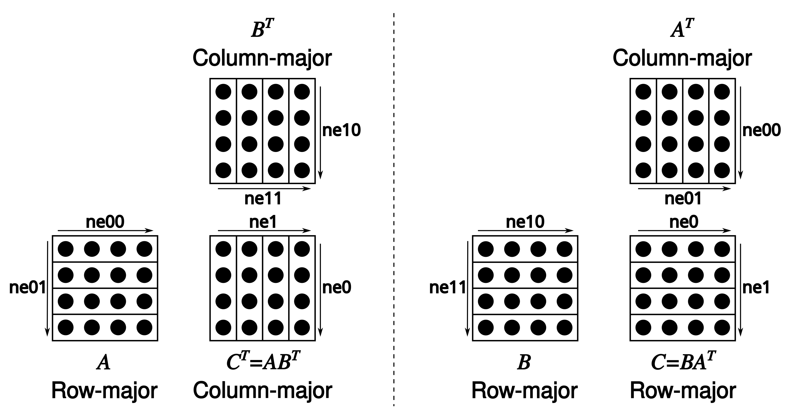

# Pull requests (for contributors)

- Test your changes:
  - Using the commands in the [`tests`](tests) folder. For instance, running the `./tests/test-backend-ops` command tests different backend implementations of the GGML library
  - Execute [the full CI locally on your machine](ci/README.md) before publishing
- Please rate the complexity of your PR (i.e. `Review Complexity : Low`, `Review Complexity : Medium`, `Review Complexity : High`). This makes it easier for maintainers to triage the PRs.
  - The PR template has a series of review complexity checkboxes `[ ]` that [you can mark as](https://docs.github.com/en/get-started/writing-on-github/working-with-advanced-formatting/about-task-lists) `[X]` for your convenience
- Consider allowing write access to your branch for faster review
- If your PR becomes stale, don't hesitate to ping the maintainers in the comments

# AI usage

AI usage is not encouraged but it is tolerated. However, if you use AI to prepare PRs, please
- Disclose it
- PRs having Claude or similar as author will be rejected.
- Minimize as much as possible the AI slop. Both, in the PR description and in the endless comments left behind in the code by the LLM. If in doubt, just remove all AI generated comments before submitting the PR. Comments can be added during the review process if needed and where appropriate.
- Please do not submit PRs that you don't understand how they work and/or have never tested (or have not tested sufficiently)

# Pull requests (for collaborators)

- Squash-merge PRs
- Use the following format for the squashed commit title: `<module> : <commit title> (#<issue_number>)`. For example: `utils : fix typo in utils.py (#1234)`

# Coding guidelines

- Avoid adding third-party dependencies, extra files, extra headers, etc.
- Always consider cross-compatibility with other operating systems and architectures
- Avoid fancy looking modern STL constructs, use basic `for` loops, avoid templates, keep it simple
- There are no strict rules for the code style, but try to follow the patterns in the code (indentation, spaces, etc.). Vertical alignment makes things more readable and easier to batch edit
- Clean-up any trailing whitespaces, use 4 spaces for indentation, brackets on the same line, `void * ptr`, `int & a`
- Tensors store data in row-major order. We refer to dimension 0 as columns, 1 as rows, 2 as matrices
- Matrix multiplication is unconventional: `C = ggml_mul_mat(ctx, A, B)` means $C^T = A B^T \Leftrightarrow C = B A^T.$

